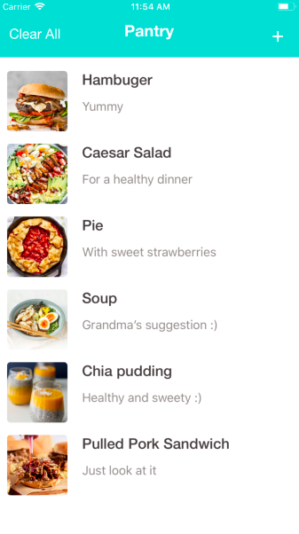
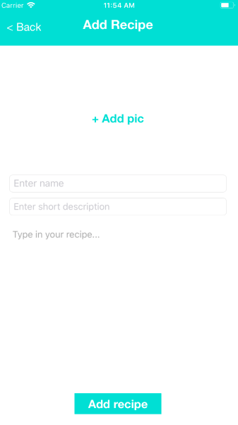
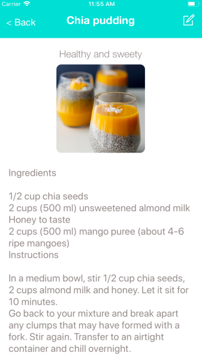
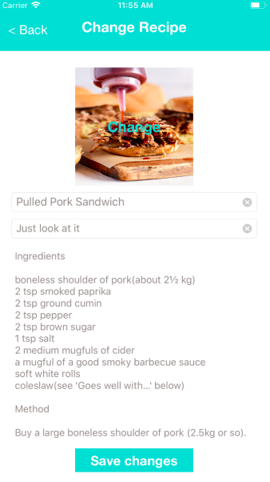

# myPantry

🌮 This is the application where you can store your secret recipes 😋

### Summary 

If you have ever **wanted to save** your friends recipe who made a delicious apple pie 🥧 or you just **figured out how to make the perfect creme brulee** 👩🏻‍🍳 and would like to save the secret of it? You just find the perfect application! 🥘

Nowadays the internet is full with millions of recipes but sometimes you just have to **customize it for your own taste**. You do not have to write it down on a piece of paper (which you will probably lose right away), print it out or even save it as a note on your phone. You just add it to MyPantry and it will be saved as long as you want. You can still modify it anytime you want. 👏🏻

### What did I learn? 👩🏻‍💻

#### I deepened my knowledge in: 🏋🏻‍

- Using of **MVC**.

- Using **UserDefaults** to save data.

- Creating **UITableView** and **UITableViewCell**.

- UITableViewDelegate, UITableViewDataSource **protocols** and how to conform to them. 

- Using **Prototype Cell**. 

- Using **Notification Center**.

- Using **Singleton**.

- How to **get access to the photo library** via info.plist.

- How prepare a class to be **encoded and decoded** by the Archiver and Un-archiver.

#### Find new challenges in: 🧗🏻‍

- How to make an **alart message**.

- How to **pass data** between views **with prepare for segue**. (With segue.identifier and segue.destination.) 

- How to **change UITableViewCell content using Notification Center**. 

- How to use **Scroll View**. 

- How to use **Text View**. 

- **Changing** the nav bar color. 

### How does it work? 🧐

1. Open MyPantry application.

2. A few of my favorite recipes are already provided but if you do not enjoy Pulled Pork sandwich or Strawberry Pie you can delete them by swiping left.

3. Click on the "+" button to add new recipe. 

4. Fill in the provided lines (name, short description, image and recipe text) and hit save recipe button. 

5. Check your full recipe by clicking on it.

6. You just figured out the perfect amount of sugar that should you put in your brownie? Never a problem! Hit the edit button.

7. Change anything you want and click save changes button. 

8. There you go! You have your well-researched recipe with a perfectly fit photo. 🎉

*This is how it looks like when you first open it.*

*Here can you add an other recipe to your collection.*

*Here you can find the full recipe.*

*Here can you modify it.*

